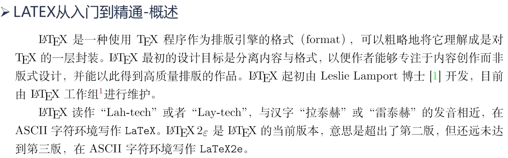

# $\LaTeX$入门教程

#### 简述



#### 基本结构

**1. 第一个LaTeX文档**
```latex
\documentclass{article}
% 导言区
\begin{document}
% 正文内容
"Hello Word" from \LaTeX
\end{document}
% 此后的内容将被忽略
```
***
**2. LaTeX命令**

***
**3. 文档类**


> 基础文档类还有派生的一些文档类,如支持中文排版的ctexart,ctexrep,ctexbook
***
**4. 导言区-宏包**

> 宏包和python的inport命令的数据包原理一致
> python没有的包要用pip下载,LaTeX也是需要下载

例程:
```latex
\documentclass{article}
% 导言区
\usepackage{makecell}
\begin{document}
% 正文内容
"Hello Word" from \LaTeX
\end{document}
% 此后的内容将被忽略
```


**5. 导言区-文件的组织方式**


> 注:section是结构命令中的节命令,此处不是重点


#### 文字、章节、引用
**1. 中文排版ctexart**


**2. 空格和分段**

|行为|命令|
|:-|:-|
|换行|`\par`|
|断行|`\\`|
|断行|`\newline`|
|取消语义|`\verb\|\|`|
|不间断空格|`~`|
|不间断短空格|`\ `|
|一个em长度空格|`\quad`|
|两个em长度空格|`\qquad`|
|禁止分页|`\\*`|
> 其中`\verb||`指令会将格式命令也取消掉,输出原样式

**3. 注释**
以`%`开头的行

**4. 转义**


**5. 断行**


**6. 断页**


